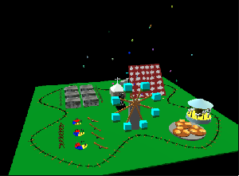
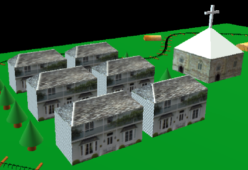
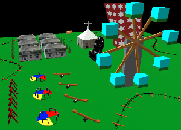
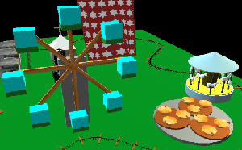
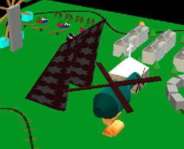
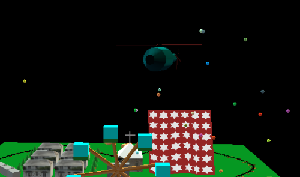
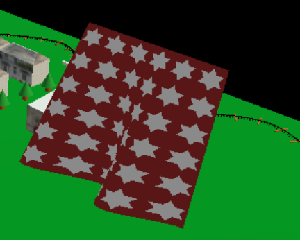
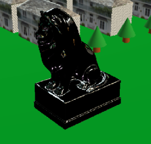

# Graphics Town: Forest Amusement Resort
## Usage statements
This set of web pages forms a "workbook" assignment for CS559, Computer Graphics at the University of Wisconsin for Spring 2021. The workbook content was primarily developed by Prof. Michael Gleicher with assistance from the course staff over the years. Students are granted the right to use the workbook content for their work in class. The workbook content is Copyright &copy; 2021, Michael Gleicher. This workbook is provided under a Creative Commons Attribution-NonCommercial 4.0 International license. See https://creativecommons.org/licenses/by-nc/4.0/ for the explanation and https://creativecommons.org/licenses/by-nc/4.0/legalcode for the license itself.

**The code in the repo is not allowed to be copied for other student assignments**

## About

[Try It Yourself](https://danielyamchen.github.io/GraphicsTown/for_students/12-grtown.html)

This is the repo for the final project of CS 559: Computer Graphics in Spring 2021. I created an animated graphics town named the Forest Amusement Resort. It includes some basic features and advanced techniques in computer graphics. More details are listed below. This project uses JavaScript, Three.js, and OpenGL shading language (GLSL).

## Features
### Living area

- This place is for living and offers each group of customers an individual villa to live, along with a church.
- Use basic vertex-based geometries and picture-based texture rendering to make different kinds of buildings.

### Recreational area
 
- One part is placed with unplugged instruments like a park, including the roundabouts, seesaws, and swings, which are suitable for children having leisured fun time in the afternoon. The other part is placed with plugged amusement facilities, including the rotating coffee cup, the ferris wheel, and a carousel, which are suitable for one-day joyable trip.
- Implement various kinds of animated motions, such as vibrations seesaws and swings, two-ordered rotations in the coffee cup and the ferris wheel, and complicated motions like the carousel, and materialize fancy 3D stuff. 

### Complicated motion series

- The last area is still under construction. The helicopter is busy in collecting the woods from the forest and carrying them to the construction site.
- The series of motions is completed with a finite state machine. The helicopter uses P control to align itself to the forward direction and the log, and uses P control to fly to destinations in each stage.

### Fireworks (particle system)

- There are fireworks sometimes blooming in the sky.
- Randomly launch fireworks to the sky from the two sides of the town. After the big fireworks explode, small fireworks come out.

### Fluttering cloth

- A fluttering cloth blown by winds
- This was achieved by writing vertex shader and fragment shader codes in GLSL. The cloth pattern is made by procedural texture. The vertex positions move sinusoidally over time, and the reflected lighting amount changes accordingly.

### Bezier-curved railway with moving tourist trains

- Trains running on a 2D bezier-curved rail with a series of ties put aligned
- The curve is shaped by the Bezier function and the ties are put with curve parameterization.

### Shining sculpture (dynamic environment map)

- A shiny lion sculpture reflecting the whole town
- It uses a dynamic environment map to real-timely render the scene viewed from the sculpture on its own surface.

## Attributions
Some attributions like 3D models, pictures, and textures will be updated.